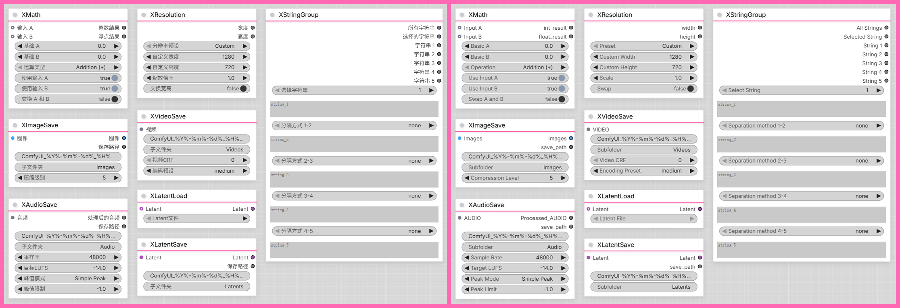

<div align="center">

# ♾️ ComfyUI-Xz3r0-Nodes ♾️

[](LICENSE)
[](https://github.com/comfyanonymous/ComfyUI)

[📜 点击查看更新日志 | Click to view the changelog 📜](Changelog.md)

</div>

---

## 📖 项目简介

**ComfyUI-Xz3r0-Nodes** 是一个设计为**高度模块化**的ComfyUI自定义节点项目，采用**自动发现架构**。

### 🎯 设计特点

- 🔧 **自动发现机制** - 在 `xnode/` 目录创建节点文件即可自动注册
- 🌍 **国际化支持** - 内置中英文界面，支持多语言扩展
- 🚫 **安全处理** - 节点中可输入的文件名和路径已做防遍历攻击处理，请使用文字，不要使用日期时间标识符以外的特殊符号！

### ✨ 当前功能

- 🛠️ **工具节点** - 数学运算、分辨率设置
- 🖼️ **图像处理** - 图像保存（支持自定义文件名和子文件夹）
- 🎬 **视频处理** - 视频保存（H.265编码，自定义质量和速度预设，音频支持）
- 🎵 **音频处理** - 音频保存（WAV无损格式，LUFS标准化，峰值限制）
- 🔮 **Latent处理** - Latent加载和保存（支持元数据）
- 📝 **数据类节点** - 字符串组合（支持多行输入和分隔方式）

---

## 🚀 快速开始

### 方法 1: ComfyUI-Manager（推荐）

1. 使用 [ComfyUI-Manager](https://github.com/Comfy-Org/ComfyUI-Manager)
2. 搜索 `ComfyUI-Xz3r0-Nodes`
3. 点击安装按钮


### 方法 2: 手动安装

1. **克隆仓库到ComfyUI的 `custom_nodes` 目录**

```bash
cd ComfyUI/custom_nodes
git clone https://github.com/Xz3r0-M/ComfyUI-Xz3r0-Nodes.git
```

2. **安装依赖**

```bash
cd ComfyUI-Xz3r0-Nodes
pip install -r requirements.txt
```

3. **重启ComfyUI**

---

<div align="center">



</div>

## 📚 节点列表和说明

<details>
<summary><strong>🛠️ 工具节点 (♾️ Xz3r0/Tools)👈</strong></summary>

### 🔢 XMath

基础数学运算节点，支持双输出格式（整数+浮点数）。

**功能**: 加法、减法、乘法、除法、幂运算、取模、最大值、最小值
- 支持输入端口和基础值两种输入方式
- 可独立切换 A 和 B 的输入来源
- 支持 A 和 B 值交换功能
- 自动处理除零和溢出等边界情况

**输入**:
- `input_a` (INT/FLOAT): 输入数值 A（接收上游节点，可选）
- `input_b` (INT/FLOAT): 输入数值 B（接收上游节点，可选）
- `basic_a` (FLOAT): 基础数值 A（默认值）
- `basic_b` (FLOAT): 基础数值 B（默认值）
- `operation`: 运算方式（下拉选择）
- `use_input_a` (BOOLEAN): 是否使用输入端口数值 A
- `use_input_b` (BOOLEAN): 是否使用输入端口数值 B
- `swap_ab` (BOOLEAN): 是否交换 A 和 B 的值

**优先级逻辑**:
- 如果 `use_input_a` 为 True，使用 `input_a`（如果未连接到其他节点则回退到 `basic_a`
- 如果 `use_input_b` 为 True，使用 `input_b`（如果未连接到其他节点则回退到 `basic_b`

**输出**:
- `int_result` (INT): 整数结果（截断小数）
- `float_result` (FLOAT): 浮点数结果（精确值）


### 📐 XResolution

分辨率设置节点，提供标准分辨率预设和自定义功能。

**功能**:
- 标准分辨率预设（16:9, 4:3, 1:1, 16:10, 21:9等）
- 倍率缩放功能
- 宽高互换功能
- 参数验证（最小1×1）

**输入**:
- `preset` (下拉选择): 预设分辨率
- `width` (INT): 自定义宽度
- `height` (INT): 自定义高度
- `scale` (FLOAT): 缩放倍率
- `swap_dimensions` (BOOLEAN): 是否交换宽高

**输出**:
- `width` (INT): 最终宽度
- `height` (INT): 最终高度

</details>


<details>
<summary><strong>🖼️ 图像节点 (♾️ Xz3r0/Image)👈</strong></summary>

### 💾 XImageSave

图像保存节点，支持自定义文件名和子文件夹管理。

**功能**:
- 支持自定义文件名和子文件夹
- 日期时间标识符替换（%Y%, %m%, %d%, %H%, %M%, %S%）
- 路径安全防护（防止路径遍历攻击）
- 自动添加序列号防止覆盖(从00001开始)
- 批量图像保存支持
- PNG 压缩级别可调节（0-9）
- 元数据保存（工作流提示词、种子值、模型信息等）

**输入**:
- `images` (IMAGE): 输入图像张量
- `filename_prefix` (STRING): 文件名前缀
- `subfolder` (STRING): 子文件夹名称
- `compression_level` (INT): PNG 压缩级别（0-9，0=无压缩，9=最大压缩）

**隐藏输入**:
- `prompt` (PROMPT): 工作流提示词（自动注入）
- `extra_pnginfo` (EXTRA_PNGINFO): 额外元数据（自动注入）

**输出**:
- `images` (IMAGE): 原始图像（透传）
- `save_path` (STRING): 保存的相对路径

</details>


<details>
<summary><strong>🎬 视频节点 (♾️ Xz3r0/Video)👈</strong></summary>

### 🎬 XVideoSave

视频保存节点，使用FFmpeg将图像序列保存为视频。

**功能**:
- 使用FFmpeg将视频对象保存为MKV格式视频
- H.265/HEVC编码，yuv444p10le像素格式
- FPS从视频对象自动获取（由官方的创建视频CreateVideo节点设置）
- 音频支持（自动从视频对象获取）
- 自定义CRF（质量参数 0-40，0为无损）
- 编码预设选择（ultrafast到veryslow，平衡编码速度和压缩效率）
- 支持自定义文件名和子文件夹
- 日期时间标识符替换（%Y%, %m%, %d%, %H%, %M%, %S%）
- 路径安全防护（防止路径遍历攻击）
- 自动添加序列号防止覆盖(从00001开始)
- 元数据保存（工作流提示词、种子值、模型信息等）

**输入**:
- `video` (VIDEO): 视频对象（包含图像序列、音频和帧率）
- `filename_prefix` (STRING): 文件名前缀（默认：`ComfyUI_%Y%-%m%-%d%_%H%-%M%-%S%`）
- `subfolder` (STRING): 子文件夹名称（默认：`Videos`）
- `crf` (FLOAT): 质量参数（默认：`0.0`，范围0-40，0为无损，40为最差质量）
- `preset` (STRING): 编码预设（默认：`medium`，可选：ultrafast, superfast, veryfast, faster, fast, medium, slow, slower, veryslow）

**隐藏输入**:
- `prompt` (PROMPT): 工作流提示词（自动注入）
- `extra_pnginfo` (EXTRA_PNGINFO): 额外元数据（自动注入）

**输出**:
- 视频预览（显示保存的视频）

**FFmpeg参数**:
- vcodec: libx265 (H.265/HEVC编码)
- pix_fmt: yuv444p10le (10位YUV 4:4:4采样)
- crf: 可配置（0=无损，40=最差质量）
- preset: 可配置（ultrafast到veryslow）
- 容器格式: MKV

</details>


<details>
<summary><strong>🎵 音频节点 (♾️ Xz3r0/Audio)👈</strong></summary>

### 🎵 XAudioSave

音频保存节点，使用WAV无损格式保存音频。

**功能**:
- 保存音频到ComfyUI默认输出目录
- WAV无损格式（PCM 16-bit）
- 支持多种采样率（44.1kHz, 48kHz, 96kHz, 192kHz）
- LUFS音量标准化（默认-14.0 LUFS，可设置为-70禁用）
- 峰值限制（三种模式：Disabled, Simple Peak, True Peak）
- 支持自定义文件名和子文件夹
- 日期时间标识符替换（%Y%, %m%, %d%, %H%, %M%, %S%）
- 路径安全防护（防止路径遍历攻击）
- 自动添加序列号防止覆盖(从00001开始)

**峰值限制模式说明**:
- `Disabled`: 禁用峰值限制
- `Simple Peak`: 简单峰值限制（快速，直接检测采样点峰值）
- `True Peak`: 广播标准True Peak限制（慢速，8x过采样，精度高）

**输入**:
- `audio` (AUDIO): 音频对象（包含波形和采样率）
- `filename_prefix` (STRING): 文件名前缀（默认：`ComfyUI_%Y%-%m%-%d%_%H%-%M%-%S%`）
- `subfolder` (STRING): 子文件夹名称（默认：`Audio`）
- `sample_rate` (STRING): 采样率（默认：`48000`，可选：44100, 48000, 96000, 192000）
- `target_lufs` (FLOAT): 目标LUFS值（默认：`-14.0`，范围-70.0到0.0，-70禁用）
- `peak_mode` (STRING): 峰值限制模式（默认：`Simple Peak`，可选：Disabled, Simple Peak, True Peak）
- `peak_limit` (FLOAT): 峰值限制值（默认：`-1.0`，范围-6.0到0.0）

**输出**:
- `processed_audio` (AUDIO): 处理后的音频（重采样、LUFS标准化、峰值限制）
- `save_path` (STRING): 保存的相对路径
</details>


<details>
<summary><strong>🔮 Latent节点 (♾️ Xz3r0/Latent)👈</strong></summary>

### 📥 XLatentLoad

Latent加载节点，支持从输入端口或文件加载Latent。

**功能**:
- 支持从上游节点输入Latent（优先级最高）
- 支持从下拉菜单选择Latent文件
- 自动扫描ComfyUI默认输出目录及其子文件夹中的.latent文件
- 文件存在性检查和错误提示
- 支持Latent格式版本自动检测
- 输出标准Latent格式字典

**输入**:
- `latent_input` (LATENT, 可选): 从上游节点接收的Latent
- `latent_file` (STRING, 下拉选择): 从下拉菜单选择Latent文件

**输出**:
- `latent` (LATENT): Latent字典

**优先级说明**:
1. 如果输入端口有Latent，直接返回输入的Latent
2. 如果输入端口为None，则从下拉菜单选择的文件加载Latent
3. 如果输入端口为None且文件不存在，弹出错误提示


### 📤 XLatentSave

Latent保存节点，支持自定义文件名和元数据保存。

**功能**:
- 保存Latent到ComfyUI默认输出目录
- 输出Latent端口可以传递到其他节点
- 支持自定义文件名和子文件夹
- 支持日期时间标识符（%Y%, %m%, %d%, %H%, %M%, %S%）
- 自动检测同名文件并添加序列号（从00001开始）
- 仅支持单级子文件夹创建
- 安全防护（防止路径遍历攻击）
- 支持元数据保存（工作流提示词、种子值、模型信息等）

**输入**:
- `latent` (LATENT): 输入Latent张量
- `filename_prefix` (STRING): 文件名前缀
- `subfolder` (STRING): 子文件夹名称

**隐藏输入**:
- `prompt` (PROMPT): 工作流提示词（自动注入）
- `extra_pnginfo` (EXTRA_PNGINFO): 额外元数据（自动注入）

**输出**:
- `latent` (LATENT): 原始Latent（透传）
- `save_path` (STRING): 保存的相对路径

</details>


<details>
<summary><strong>📝 数据类节点 (♾️ Xz3r0/Types)👈</strong></summary>

### 🔗 XStringGroup

字符串组合节点，支持多行输入和自定义分隔符。

**功能**:
- 支持最多5个多行字符串输入
- 每个字符串之间可选择不同的分隔方式（无、换行、空格、逗号、逗号+空格、句号、句号+空格）
- 输出组合后的完整字符串
- 支持选择单个字符串输出（1-5）
- 支持每个字符串的原始输出

**输入**:
- `select_string` (下拉选择): 选择要输出的字符串编号（1-5）
- `string_1` (STRING, 多行): 第一个字符串
- `separation_method_1_2` (下拉选择): 字符串1和2之间的分隔方式
- `string_2` (STRING, 多行): 第二个字符串
- `separation_method_2_3` (下拉选择): 字符串2和3之间的分隔方式
- `string_3` (STRING, 多行): 第三个字符串
- `separation_method_3_4` (下拉选择): 字符串3和4之间的分隔方式
- `string_4` (STRING, 多行): 第四个字符串
- `separation_method_4_5` (下拉选择): 字符串4和5之间的分隔方式
- `string_5` (STRING, 多行): 第五个字符串

**分隔方式选项**:
- `none`: 无分隔
- `newline`: 换行符（`\n`）
- `space`: 空格（` `）
- `comma`: 逗号（`,`）
- `comma_space`: 逗号+空格（`, `）
- `period`: 句号（`.`）
- `period_space`: 句号+空格（`. `）

**输出**:
- `total_string` (STRING): 组合后的完整字符串（带有分隔方式）
- `selected_string` (STRING): 由选择字符串栏所选择的输出
- `string_1` (STRING): 字符串1的原始输出
- `string_2` (STRING): 字符串2的原始输出
- `string_3` (STRING): 字符串3的原始输出
- `string_4` (STRING): 字符串4的原始输出
- `string_5` (STRING): 字符串5的原始输出

**使用场景**:
- 构建复杂提示词组合
- 生成多行文本描述
- 创建带格式化的文本输出
- 工作流中的文本处理和组合

</details>

---

## 🌍 国际化支持

ComfyUI-Xz3r0-Nodes 内置了中英文双语界面支持，通过 `locales/` 目录实现多语言切换。

### 支持的语言

- 🇬🇧 **English** - 英文界面
- 🇨🇳 **中文** - 中文界面

### 工作原理

- ComfyUI 会根据您的系统语言自动选择对应的界面语言
- 节点名称、参数描述和提示信息都会自动翻译
- 如需添加新的语言支持，只需在 `locales/` 目录下创建对应语言的 `nodeDefs.json` 文件

### 添加新语言

如果您想为项目贡献新的语言支持，请参考 `locales/en/nodeDefs.json` 的格式创建新的语言文件，并提交 Pull Request。

---

## 📦 依赖说明

### Python 依赖

项目依赖在 `requirements.txt` 中定义，主要包括：

**本项目的额外依赖**:

- **ffmpeg-python** - FFmpeg Python 绑定（视频处理，XVideoSave 节点使用）
- **pyloudnorm** - LUFS 音量标准化库（音频处理，XAudioSave 节点使用）

---

## 📁 项目结构

```
ComfyUI-Xz3r0-Nodes/
├── __init__.py          # 主入口 + 自动发现机制
├── xnode/               # 节点目录（自动发现）
│   ├── __init__.py
│   ├── xmath.py         # 数学运算节点
│   ├── xresolution.py   # 分辨率设置节点
│   ├── ximagesave.py    # 图像保存节点
│   ├── xvideosave.py    # 视频保存节点
│   ├── xaudiosave.py    # 音频保存节点
│   ├── xlatentload.py   # Latent加载节点
│   ├── xlatentsave.py   # Latent保存节点
│   └── xstringgroup.py  # 字符串组合节点
├── locales/             # 国际化支持（节点显示名称和提示）
│   ├── en/              # 英文定义
│   │   └── nodeDefs.json
│   └── zh/              # 中文定义
│       └── nodeDefs.json
├── requirements.txt     # Python依赖清单
└── README.md            # 项目文档
```

---

## 📄 许可证

本项目采用 MIT 许可证 - 详见 [LICENSE](LICENSE) 文件

---

## 🙏 致谢

- [ComfyUI](https://github.com/comfyanonymous/ComfyUI) - 强大的基于节点的图像生成UI

---

## 📞 项目链接

- **项目主页**: [https://github.com/Xz3r0-M/ComfyUI-Xz3r0-Nodes](https://github.com/Xz3r0-M/ComfyUI-Xz3r0-Nodes)
- **问题反馈**: [GitHub Issues](https://github.com/Xz3r0-M/ComfyUI-Xz3r0-Nodes/issues)
- **Comfy Registry主页**: [Comfy Registry](https://registry.comfy.org/zh/publishers/xz3r0/nodes/xz3r0-nodes)

---

<div align="center">

**⭐ 如果这个项目对你有帮助，请给个星标支持一下！**

</div>
