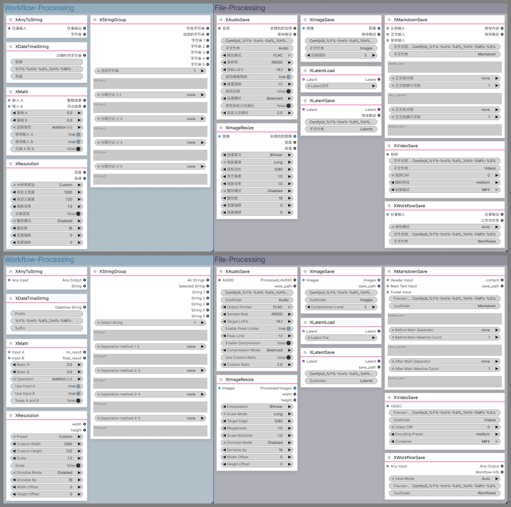

<div align="center">

# ♾️ ComfyUI-Xz3r0-Nodes ♾️

[](LICENSE)
[](https://github.com/comfyanonymous/ComfyUI)


**如果这个项目对你有帮助，请给个星标⭐支持一下！**

[📜 点击查看更新日志 | Click to view the changelog 📜](Changelog.md)
</div>

---

## 📖 项目简介

ComfyUI-Xz3r0-Nodes 是一个ComfyUI自定义节点项目，当前主要目标为创建增强的基础功能节点

### 🎯 设计特点

- 🌍 多语言界面 - 节点目前支持 🇨🇳 `中文` 🇬🇧 `English` 界面
    - ComfyUI 会根据您的UI页面设置所选择的语言来调用节点的语言文件，节点名称、参数描述和提示信息都会按照语言文件自动翻译
    - 如果节点没有支持您使用的UI界面语言会默认显示节点代码的文字而不是语言文件(* 这可能是ComfyUI的BUG)
    - 如果您想为项目贡献新的语言支持，请参考项目中 `locales/en/nodeDefs.json` 的格式创建新的语言文件，并提交 Pull Request🤝
- 🚫 安全处理 - 节点中可输入的文件名和路径已做防遍历攻击处理，请使用文字，不要使用日期时间标识符以外的特殊符号！

### ✨ 项目节点和工具数量

🎁 自定义节点 （数量总计：`10`）

- 🛠️ 工具节点 - 数学运算、分辨率设置
- 📝 数据类节点 - 字符串组合 (支持多行输入和分隔方式)、日期时间标识符字符串
- 🖼️ 图像处理 - 图像保存 (支持自定义文件名和子文件夹)
- 🎬 视频处理 - 视频保存 (H.265编码，自定义质量和速度预设，音频支持)
- 🎵 音频处理 - 音频保存 (WAV无损格式，LUFS标准化，峰值限制)
- 🔮 Latent处理 - Latent加载和保存 (支持元数据)
- ⌨️ 工作流节点 - 工作流元数据保存


🧩 网页扩展工具 （数量总计：`1`）

- ⌨️ 工作流工具 - 工作流元数据可视化查看工具

---

## 💖 安装

### 方法 1: ComfyUI-Manager (推荐)

1. 使用 [ComfyUI-Manager](https://github.com/Comfy-Org/ComfyUI-Manager)
2. 搜索 `ComfyUI-Xz3r0-Nodes`
3. 点击安装按钮


### 方法 2: 手动安装

1. 克隆本仓库到ComfyUI的 `custom_nodes` 目录

```bash
cd ComfyUI/custom_nodes
git clone https://github.com/Xz3r0-M/ComfyUI-Xz3r0-Nodes.git
```

2. 安装依赖

```bash
cd ComfyUI-Xz3r0-Nodes
pip install -r requirements.txt
```

3. 重启ComfyUI

---

## 📦 依赖说明（重要必看）

本项目当前需要在您的电脑中安装有以下依赖程序：
- **⚠️ [FFmpeg](https://www.ffmpeg.org/download.html)** - 安装并配置到**系统环境（PATH）**，如果不安装FFmpeg，那么 `XVideoSave` 和 `XAudioSave` 节点将无法正常使用‼️

---

<div align="center">




</div>

## 📚 详细说明（推荐查看）

<details>
<summary>🛠️ 工具节点 👈</summary>

### 🔢 XMath
`♾️ Xz3r0/Workflow-Processing`

基础数学运算节点，支持双输出格式 (整数+浮点数)

**功能**: 加法、减法、乘法、除法、幂运算、取模、最大值、最小值
- 支持输入端口和基础值两种输入方式
- 可独立切换 A 和 B 的输入来源
- 支持 A 和 B 值交换功能
- 自动处理除零和溢出等边界情况

**输入**:
- `input_a` (INT/FLOAT): 输入数值 A (接收上游节点，可选)
- `input_b` (INT/FLOAT): 输入数值 B (接收上游节点，可选)
- `basic_a` (FLOAT): 基础数值 A (默认值)
- `basic_b` (FLOAT): 基础数值 B (默认值)
- `operation`: 运算方式 (下拉选择)
- `use_input_a` (BOOLEAN): 是否使用输入端口数值 A
- `use_input_b` (BOOLEAN): 是否使用输入端口数值 B
- `swap_ab` (BOOLEAN): 是否交换 A 和 B 的值

**优先级逻辑**:
- 如果 `use_input_a` 为 True，使用 `input_a` (如果未连接到其他节点则回退到 `basic_a`
- 如果 `use_input_b` 为 True，使用 `input_b` (如果未连接到其他节点则回退到 `basic_b`

**输出**:
- `int_result` (INT): 整数结果 (截断小数)
- `float_result` (FLOAT): 浮点数结果 (精确值)

---

### 📐 XResolution
`♾️ Xz3r0/Workflow-Processing`

分辨率设置节点，提供标准分辨率预设和自定义功能

**功能**:
- 标准分辨率预设 (16:9, 4:3, 1:1, 16:10, 21:9等)
- 倍率缩放功能
- 宽高互换功能
- 参数验证 (最小1×1)

**输入**:
- `preset` (下拉选择): 预设分辨率
- `width` (INT): 自定义宽度
- `height` (INT): 自定义高度
- `scale` (FLOAT): 缩放倍率
- `swap_dimensions` (BOOLEAN): 是否交换宽高

**输出**:
- `width` (INT): 最终宽度
- `height` (INT): 最终高度

</details>


<details>
<summary>📝 数据类节点 👈</summary>

### 🔗 XStringGroup
`♾️ Xz3r0/Workflow-Processing`

字符串组合节点，支持多行输入和自定义分隔符

**功能**:
- 支持最多5个多行字符串输入
- 每个字符串之间可选择不同的分隔方式 (无、换行、空格、逗号、逗号+空格、句号、句号+空格)
- 输出组合后的完整字符串
- 支持选择单个字符串输出 (1-5)
- 支持每个字符串的原始输出

**输入**:
- `select_string` (下拉选择): 选择要输出的字符串编号 (1-5)
- `string_1` (STRING, 多行): 第一个字符串
- `separation_method_1_2` (下拉选择): 字符串1和2之间的分隔方式
- `string_2` (STRING, 多行): 第二个字符串
- `separation_method_2_3` (下拉选择): 字符串2和3之间的分隔方式
- `string_3` (STRING, 多行): 第三个字符串
- `separation_method_3_4` (下拉选择): 字符串3和4之间的分隔方式
- `string_4` (STRING, 多行): 第四个字符串
- `separation_method_4_5` (下拉选择): 字符串4和5之间的分隔方式
- `string_5` (STRING, 多行): 第五个字符串

**分隔方式选项**:
- `none`: 无分隔
- `newline`: 换行符 (`\n`)
- `space`: 空格 (` `)
- `comma`: 逗号 (`,`)
- `comma_space`: 逗号+空格 (`, `)
- `period`: 句号 (`.`)
- `period_space`: 句号+空格 (`. `)

**输出**:
- `total_string` (STRING): 组合后的完整字符串 (带有分隔方式)
- `selected_string` (STRING): 由选择字符串栏所选择的输出
- `string_1` (STRING): 字符串1的原始输出
- `string_2` (STRING): 字符串2的原始输出
- `string_3` (STRING): 字符串3的原始输出
- `string_4` (STRING): 字符串4的原始输出
- `string_5` (STRING): 字符串5的原始输出

**使用场景**:
- 构建复杂提示词组合
- 生成多行文本描述
- 创建带格式化的文本输出
- 工作流中的文本处理和组合

---

### 📅 XDateTimeString
`♾️ Xz3r0/Workflow-Processing`

日期时间字符串节点，生成包含日期时间标识符的格式化字符串

**功能**:
- 支持自定义格式模板
- 支持多种日期时间占位符 (%Y%, %m%, %d%, %H%, %M%, %S%)
- 支持添加前缀和后缀
- 实时生成当前日期时间字符串
- 用于链接给本身不支持日期标识符的节点作为文件名

**支持的占位符**:
- `%Y%` - 四位年份 (如: 2026)
- `%m%` - 两位月份 (01-12)
- `%d%` - 两位日期 (01-31)
- `%H%` - 两位小时 (00-23)
- `%M%` - 两位分钟 (00-59)
- `%S%` - 两位秒数 (00-59)

**输入**:
- `prefix` (STRING): 前缀字符串，添加到日期时间之前
- `format_template` (STRING): 格式模板 (默认: `%Y%-%m%-%d%_%H%-%M%-%S%`)
- `suffix` (STRING): 后缀字符串，添加到日期时间之后

**输出**:
- `datetime_string` (STRING): 格式化后的日期时间字符串

**使用示例**:
```
prefix="Image_",
format_template="%Y%-%m%-%d%_%H%-%M%-%S%",
suffix="_v1"
输出: "Image_2026-02-21_14-30-52_v1"
```

</details>


<details>
<summary>🖼️ 图像节点 👈</summary>

### 💾 XImageSave
`♾️ Xz3r0/File-Processing`

图像保存节点，支持自定义文件名和子文件夹管理

**功能**:
- 支持自定义文件名和子文件夹
- 日期时间标识符替换 (%Y%, %m%, %d%, %H%, %M%, %S%)
- 路径安全防护 (防止路径遍历攻击)
- 自动添加序列号防止覆盖(从00001开始)
- 批量图像保存支持
- PNG 压缩级别可调节 (0-9)
- 元数据保存 (工作流提示词、种子值、模型信息等)

**输入**:
- `images` (IMAGE): 输入图像张量
- `filename_prefix` (STRING): 文件名前缀
- `subfolder` (STRING): 子文件夹名称
- `compression_level` (INT): PNG 压缩级别 (0-9，0=无压缩，9=最大压缩)

**隐藏输入**:
- `prompt` (PROMPT): 工作流提示词 (自动注入)
- `extra_pnginfo` (EXTRA_PNGINFO): 额外元数据 (自动注入)

**输出**:
- `images` (IMAGE): 原始图像 (透传)
- `save_path` (STRING): 保存的相对路径

</details>


<details>
<summary>🎬 视频节点 👈</summary>

### 🎬 XVideoSave
`♾️ Xz3r0/File-Processing`

视频保存节点，使用FFmpeg将图像序列保存为视频

**功能**:
- 使用FFmpeg将视频对象保存为MKV格式视频
- H.265/HEVC编码，yuv444p10le像素格式
- FPS从视频对象自动获取 (由官方的创建视频CreateVideo节点设置)
- 音频支持 (自动从视频对象获取)
- 自定义CRF (质量参数 0-40，0为无损)
- 编码预设选择 (ultrafast到veryslow，平衡编码速度和压缩效率)
- 支持自定义文件名和子文件夹
- 日期时间标识符替换 (%Y%, %m%, %d%, %H%, %M%, %S%)
- 路径安全防护 (防止路径遍历攻击)
- 自动添加序列号防止覆盖(从00001开始)

**输入**:
- `video` (VIDEO): 视频对象 (包含图像序列、音频和帧率)
- `filename_prefix` (STRING): 文件名前缀 (默认：`ComfyUI_%Y%-%m%-%d%_%H%-%M%-%S%`)
- `subfolder` (STRING): 子文件夹名称 (默认：`Videos`)
- `crf` (FLOAT): 质量参数 (默认：`0.0`，范围0-40，0为无损，40为最差质量)
- `preset` (STRING): 编码预设 (默认：`medium`，可选：ultrafast, superfast, veryfast, faster, fast, medium, slow, slower, veryslow)

**输出**:
- 视频预览 (显示保存的视频)

**FFmpeg参数**:
- vcodec: libx265 (H.265/HEVC编码)
- pix_fmt: yuv444p10le (10位YUV 4:4:4采样)
- crf: 可配置 (0=无损，40=最差质量)
- preset: 可配置 (ultrafast到veryslow)
- 容器格式: MKV

</details>


<details>
<summary>🎵 音频节点 👈</summary>

### 🎵 XAudioSave
`♾️ Xz3r0/File-Processing`

音频保存节点，使用WAV无损格式保存音频，支持压缩和LUFS标准化以及峰值限制

**功能**:
- 保存音频到ComfyUI默认输出目录
- WAV无损格式 (PCM 32-bit float)
- 支持多种采样率 (44.1kHz, 48kHz, 96kHz, 192kHz)
- 可以使用压缩器 (acompressor滤镜，三种预设：快速/平衡/缓慢)
- 支持自定义压缩比 (1.0-20.0)
- LUFS音量标准化 (默认-14.1 LUFS，可设置为-70禁用)
- 可以使用峰值限制 (True Peak)
- 支持自定义文件名和子文件夹
- 日期时间标识符替换 (%Y%, %m%, %d%, %H%, %M%, %S%)
- 路径安全防护 (防止路径遍历攻击)
- 自动添加序列号防止覆盖(从00001开始)

**处理流程**:
1. 使用FFmpeg的压缩器 acompressor 滤镜 (如果启用) :
   - 选择预设模式 (快速/平衡/缓慢)
   - 可选使用自定义压缩比覆盖预设值
   - 对音频进行动态范围压缩
2. 使用 loudnorm 滤镜 双阶段处理进行 LUFS 标准化和限制峰值 (如果启用)
3. 最终测量音频信息验证结果

**压缩预设参数说明**:
- 阈值自适应计算: `threshold = actual_lufs + (actual_lufs - target_lufs) * 0.3 + base_offset`
- **快速**: 适合语音/播客，base_offset=6dB, ratio=3:1, attack=10ms, release=50ms
- **平衡**: 通用/音乐，base_offset=4dB, ratio=2:1, attack=20ms, release=250ms
- **缓慢**: 适合母带/广播，base_offset=2dB, ratio=1.5:1, attack=50ms, release=500ms
- 如果您不了解音频处理，简单来说，压缩器会让符合条件即超过音量阈值 (`threshold`) 的声音降低. 选择快速预设时压缩器遇到符合的声音会反应迅速但工作时间短，适合处理音频中极短出现的声音 (比如:鼓的敲击声和双手的拍打声) 可以让其听起来不再那么尖锐. 相反的，选择缓慢预设时压缩器遇到符合条件的声音反应会较慢但工作时间更长所以更适合处理持续时间更长的声音 (比如悠长的人声) 可以让其听起来更加紧凑. 为了简化节点，对于阈值使用公式根据音频的响度(LUFS)以及压缩预设的偏移量 (`base_offset`) 来自动设置阈值
- 压缩比 (`ratio`) 是压缩器降低声音的幅度 (比例)，压缩比越高声音被降低得越多，预设带有压缩比，可以自定义
**峰值限制说明**:
- 使用 True Peak 方式 (广播标准，8x过采样，精度高) 限制音量峰值来尽可能避免削波失真

**输入**:
- `audio` (AUDIO): 音频对象 (包含波形和采样率)
- `filename_prefix` (STRING): 文件名前缀 (默认：`ComfyUI_%Y%-%m%-%d%_%H%-%M%-%S%`)
- `subfolder` (STRING): 子文件夹名称 (默认：`Audio`)
- `sample_rate` (STRING): 采样率 (默认：`48000`，可选：44100, 48000, 96000, 192000)
- `target_lufs` (FLOAT): 目标LUFS值 (默认：`-14.1`，范围-70.0到0.0，-70禁用)
- `enable_peak_limiter` (BOOLEAN): 是否启用峰值限制 (默认：True)
- `peak_limit` (FLOAT): 峰值限制值 (默认：`-1.1`，范围-6.0到0.0)
- `enable_compression` (BOOLEAN): 是否启用压缩 (默认：False)
- `compression_mode` (STRING): 压缩预设模式 (默认：`Balanced`，可选：Fast, Balanced, Slow)
- `use_custom_ratio` (BOOLEAN): 是否使用自定义压缩比 (默认：False)
- `custom_ratio` (FLOAT): 自定义压缩比 (默认：`2.0`，范围1.0到20.0)

**输出**:
- `processed_audio` (AUDIO): 处理后的音频 (重采样、压缩、LUFS标准化、峰值限制)
- `save_path` (STRING): 保存的相对路径
</details>


<details>
<summary>🔮 Latent节点 👈</summary>

### 📥 XLatentLoad
`♾️ Xz3r0/File-Processing`

Latent加载节点，支持从输入端口或文件加载Latent

**功能**:
- 支持从上游节点输入Latent (优先级最高)
- 支持从下拉菜单选择Latent文件
- 自动扫描ComfyUI默认输出目录及其子文件夹中的.latent文件
- 文件存在性检查和错误提示
- 支持Latent格式版本自动检测
- 输出标准Latent格式字典

**输入**:
- `latent_input` (LATENT, 可选): 从上游节点接收的Latent
- `latent_file` (STRING, 下拉选择): 从下拉菜单选择Latent文件

**输出**:
- `latent` (LATENT): Latent字典

**优先级说明**:
1. 如果输入端口有Latent，直接返回输入的Latent
2. 如果输入端口为None，则从下拉菜单选择的文件加载Latent
3. 如果输入端口为None且文件不存在，弹出错误提示

---

### 📤 XLatentSave
`♾️ Xz3r0/File-Processing`

Latent保存节点，支持自定义文件名和元数据保存

**功能**:
- 保存Latent到ComfyUI默认输出目录
- 输出Latent端口可以传递到其他节点
- 支持自定义文件名和子文件夹
- 支持日期时间标识符 (%Y%, %m%, %d%, %H%, %M%, %S%)
- 自动检测同名文件并添加序列号 (从00001开始)
- 仅支持单级子文件夹创建
- 安全防护 (防止路径遍历攻击)
- 支持元数据保存 (工作流提示词、种子值、模型信息等)

**输入**:
- `latent` (LATENT): 输入Latent张量
- `filename_prefix` (STRING): 文件名前缀
- `subfolder` (STRING): 子文件夹名称

**隐藏输入**:
- `prompt` (PROMPT): 工作流提示词 (自动注入)
- `extra_pnginfo` (EXTRA_PNGINFO): 额外元数据 (自动注入)

**输出**:
- `latent` (LATENT): 原始Latent (透传)
- `save_path` (STRING): 保存的相对路径

</details>


<details>
<summary>⌨️ 工作流节点和工具 👈</summary>

### 📄 XWorkflowSave
`♾️ Xz3r0/File-Processing`

工作流保存节点，将ComfyUI工作流保存为JSON文件（适配 `XMetadataWorkflow`），支持自定义文件名和子文件夹

**功能**:
- 保存工作流到ComfyUI默认输出目录
- 支持自定义文件名和子文件夹
- 日期时间标识符替换 (%Y%, %m%, %d%, %H%, %M%, %S%)
- 路径安全防护 (防止路径遍历攻击)
- 自动添加序列号防止覆盖(从00001开始)
- 仅支持单级子文件夹创建
- 保存工作流元数据 (prompt 和 workflow)

**输入**:
- `anything` (ANY): 任意输入类型，用于工作流连接。此输入不处理数据，仅用于将节点链接到工作流中
- `filename_prefix` (STRING): 文件名前缀 (默认：`ComfyUI_%Y%-%m%-%d%_%H%-%M%-%S%`)
- `subfolder` (STRING): 子文件夹名称 (默认：`Workflows`)

**隐藏输入**:
- `prompt` (PROMPT): 工作流提示词 (自动注入)
- `extra_pnginfo` (EXTRA_PNGINFO): 额外元数据 (自动注入)

---

### 📊 XMetadataWorkflow
`🖥️ 浮动窗口（按钮）`

工作流元数据查看器工具，简易的网页类型的工具，用于可视化查看ComfyUI工作流

**功能**:
- 支持多种文件格式：PNG图片、Latent文件、JSON工作流文件
- 简单的自动层级布局算法排列节点
- 显示节点类型、参数和连接关系
- 子图(Subgraph)自动颜色标记
- 支持缩放、平移、自适应视图
- 折叠/展开节点参数
- 选中节点高亮相关连接

**支持的文件**:
- PNG图片 (包含工作流元数据的生成图片)
- Latent潜空间文件 (.latent)
- JSON工作流文件 (适配 `XWorkflowSave` 生成的JSON文件，**不支持**ComfyUI网页导出功能的JSON文件, 因为缺少 prompt 字段导致缺失节点参数名)

**技术说明**:
- 只使用 prompt 字段格式数据 (ComfyUI API)
- 子图通过节点ID中的 ":" 识别 (如 "18:8" 表示子图18中的节点8)
- 节点位置使用简单的自动排列算法
- 由于ComfyUI本身默认储存元数据方式的原因，使用 prompt 字段格式元数据会导致某些节点或参数不会显示在窗口视图中(比如： `Markdown Note`)

**两种使用方式**:
1. **在ComfyUI中使用（集成）**: 点击ComfyUI页面顶部菜单栏的 ♾️ 按钮，可打开或关闭浮动窗口，已将此网页工具嵌入到该浮动窗口中


2. **浏览器直接打开（独立）**: 直接打开 `web/xmetadataworkflow.html` 文件，在浏览器中使用

</details>


<details>
<summary>🧩 ComfyUI网页扩展 👈</summary>

### 🖥️ 浮动窗口（按钮）
`ComfyUI网页扩展 - 顶部菜单栏`

为ComfyUI页面增加可打开的浮动窗口

**窗口功能**
- `XMetadataWorkflow`（工作流元数据查看器）

**使用按钮**:
- 在ComfyUI页面顶部菜单栏中的 ♾️ 按钮，点击可 打开或关闭 浮动窗口


**禁用按钮**:
- ComfyUI 页面 ➡️ 设置 ➡️ 扩展栏 ➡️ 点击扩展列表中此扩展 `ComfyUI.Xz3r0.xz3r0window` 右侧的开关按钮为关闭 ➡️ 刷新网页后顶部菜单栏的按钮就会消失


</details>

---

## 📁 项目结构
<details>

```
ComfyUI-Xz3r0-Nodes/
├── .github/             # GitHub Actions
│   └── workflows/
│       └── publish.yml
├── __init__.py          # 主入口
├── xnode/               # 节点目录
│   ├── __init__.py
│   ├── xmath.py         # 数学运算节点
│   ├── xresolution.py   # 分辨率设置节点
│   ├── xdatetimestring.py     # 日期时间字符串节点
│   ├── ximagesave.py    # 图像保存节点
│   ├── xvideosave.py    # 视频保存节点
│   ├── xaudiosave.py    # 音频保存节点
│   ├── xlatentload.py   # Latent加载节点
│   ├── xlatentsave.py   # Latent保存节点
│   ├── xstringgroup.py  # 字符串组合节点
│   └── xworkflowsave.py # 工作流保存节点
├── web/                 # 网页扩展目录
│   ├── xz3r0window.js   # ComfyUI浮动窗口扩展
│   └── xmetadataworkflow.html  # 工作流元数据查看器
├── locales/             # 国际化支持 (节点显示名称和提示)
│   ├── en/              # 英文定义
│   │   └── nodeDefs.json
│   └── zh/              # 中文定义
│       └── nodeDefs.json
├── preview/             # 预览图片
│   └── preview.png
├── .gitignore           # Git 忽略文件
├── Changelog.md         # 更新日志
├── LICENSE              # MIT 许可证
├── pyproject.toml       # Comfy Registry配置文件
├── requirements.txt     # Python 依赖清单
└── README.md            # 项目文档
```

</details>

---

## 📄 许可证

本项目采用 MIT 许可证 - 详见 [LICENSE](LICENSE) 文件

---

## 🙏 致谢

- [ComfyUI](https://github.com/comfyanonymous/ComfyUI) - 强大的基于节点的图像生成UI

---

## 📞 项目链接

- **项目主页**: [https://github.com/Xz3r0-M/ComfyUI-Xz3r0-Nodes](https://github.com/Xz3r0-M/ComfyUI-Xz3r0-Nodes)
- **问题反馈**: [GitHub Issues](https://github.com/Xz3r0-M/ComfyUI-Xz3r0-Nodes/issues)
- **Comfy Registry主页**: [Comfy Registry](https://registry.comfy.org/zh/publishers/xz3r0/nodes/xz3r0-nodes)

---
