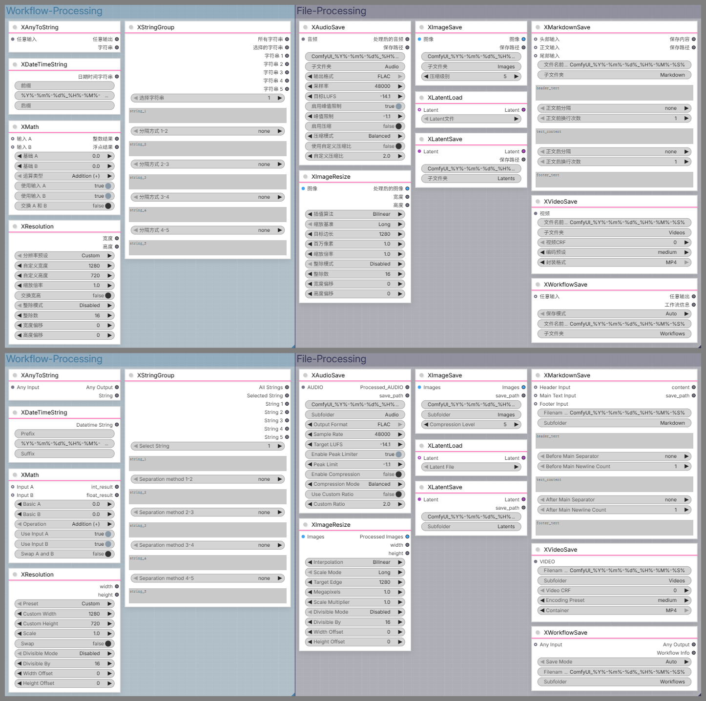

<div align="center">

# ♾️ ComfyUI-Xz3r0-Nodes ♾️

[](LICENSE)
[](https://github.com/comfyanonymous/ComfyUI)


**如果这个项目对你有帮助，请给个星标⭐支持一下！**

[📜 点击查看更新日志 | Click to view the changelog 📜](Changelog.md)
</div>

---

## 📖 项目简介

ComfyUI-Xz3r0-Nodes 是一个 ComfyUI 自定义节点项目，当前主要目标为创建增强的基础功能节点

### 🎯 设计特点

- 🌍 多语言界面 - 节点目前支持 🇨🇳 `中文` 🇬🇧 `English` 界面
    - ComfyUI 会根据您的UI页面设置所选择的语言来调用节点的语言文件，节点名称、参数描述和提示信息都会按照语言文件自动翻译
    - 如果节点没有支持您使用的 UI 界面语言会默认显示节点代码的文字而不是回退到英文语言(* 这可能是 ComfyUI 的 BUG)
    - 如果您想为项目贡献新的语言支持，请参考项目中 `locales/en/nodeDefs.json` 的格式创建新的语言文件，并提交 Pull Request🤝
- 🚫 安全处理 - 节点中可输入的文件名和路径已做防遍历攻击处理，请使用文字，不要使用日期时间标识符以外的特殊符号！

### ✨ 项目节点和工具数量

🎁 自定义节点 （数量总计：`11`）

- 🛠️ 工具节点
  - 数学运算
  - 分辨率设置
- 📝 数据类节点
  - 字符串组合 (支持多行输入和分隔方式)
  - 日期时间标识符字符串
- 🖼️ 图像处理
  - 图像缩放 (保持宽高比的多种缩放模式)
  - 图像保存 (支持自定义文件名和子文件夹)
- 🎬 视频处理
  - 视频保存 (H.265 编码，自定义质量和速度预设，音频支持)
- 🎵 音频处理
  - 音频保存 (WAV 无损格式，LUFS 标准化，峰值限制)
- 🔮 Latent 处理
  - Latent 加载
  - Latent 保存 (支持元数据)
- ⌨️ 工作流节点
  - 工作流元数据保存


🧩 网页扩展工具 （数量总计：`3`）

- ⌨️ 工作流工具
  - XMetadataWorkflow 工作流元数据可视化查看工具
  - XWorkflowSave 网页扩展（捕获完整工作流元数据）
- 🔍 视图工具
  - XFitView（工作流和子图页面自动适应视图）

---

## 💖 安装

### 方法 1: ComfyUI-Manager (推荐)

1. 使用 [ComfyUI-Manager](https://github.com/Comfy-Org/ComfyUI-Manager)
2. 搜索 `ComfyUI-Xz3r0-Nodes`
3. 点击安装按钮


### 方法 2: 手动安装

1. 克隆本仓库到 ComfyUI 的 `custom_nodes` 目录

```bash
cd ComfyUI/custom_nodes
git clone https://github.com/Xz3r0-M/ComfyUI-Xz3r0-Nodes.git
```

2. 安装依赖

```bash
cd ComfyUI-Xz3r0-Nodes
pip install -r requirements.txt
```

3. 重启 ComfyUI

---

## 📦 依赖说明（重要必看）

本项目当前需要在您的电脑中安装有以下依赖程序：
- **⚠️ [FFmpeg](https://www.ffmpeg.org/download.html)** - 安装并配置到**系统环境（PATH）**，如果不安装 FFmpeg，那么 `XVideoSave` 和 `XAudioSave` 节点将无法正常使用‼️

---

<div align="center">

## 节点预览


## XMetadataWorkflow 预览
🌐 在线使用: https://xz3r0-m.github.io/ComfyUI-Xz3r0-Nodes

</div>

---

## 📚 节点详细说明（推荐查看）

<details>

### 🔢 XMath
<details>

`♾️ Xz3r0/Workflow-Processing`

基础数学运算节点，支持双输出格式 (整数+浮点数)

**功能**: 加法、减法、乘法、除法、幂运算、取模、最大值、最小值
- 支持输入端口和基础值两种输入方式
- 可独立切换 A 和 B 的输入来源
- 支持 A 和 B 值交换功能
- 自动处理除零和溢出等边界情况

**输入**:
- `input_a` (INT/FLOAT): 输入数值 A (接收上游节点，可选)
- `input_b` (INT/FLOAT): 输入数值 B (接收上游节点，可选)
- `basic_a` (FLOAT): 基础数值 A (默认值)
- `basic_b` (FLOAT): 基础数值 B (默认值)
- `operation`: 运算方式 (下拉选择)
- `use_input_a` (BOOLEAN): 是否使用输入端口数值 A
- `use_input_b` (BOOLEAN): 是否使用输入端口数值 B
- `swap_ab` (BOOLEAN): 是否交换 A 和 B 的值

**优先级逻辑**:
- 如果 `use_input_a` 为 True，使用 `input_a` (如果未连接到其他节点则回退到 `basic_a`
- 如果 `use_input_b` 为 True，使用 `input_b` (如果未连接到其他节点则回退到 `basic_b`

**输出**:
- `int_result` (INT): 整数结果 (截断小数)
- `float_result` (FLOAT): 浮点数结果 (精确值)
</details>

### 📐 XResolution
<details>

`♾️ Xz3r0/Workflow-Processing`

分辨率设置节点，提供标准分辨率预设、自定义缩放和整除调整功能

**功能**:
- 标准分辨率预设 (16:9, 4:3, 1:1, 16:10, 21:9 等)
- 倍率缩放功能
- 宽高互换功能
- 整除调整功能 - 使分辨率可被指定整数整除（常用值：8、16、32、64）
- 分辨率偏移功能 - 在最终分辨率上添加偏移值（范围：-128 到 128）
- 参数验证 (最小 1×1)

**输入**:
- `preset` (下拉选择): 预设分辨率
- `width` (INT): 自定义宽度
- `height` (INT): 自定义高度
- `scale` (FLOAT): 缩放倍率
- `swap` (BOOLEAN): 是否交换宽高
- `divisible` (INT): 整除数（默认：16，范围 1-128）
- `divisible_mode` (下拉选择): 取整方式（默认：Disabled）
  - `Disabled`: 禁用整除调整
  - `Nearest`: 取最接近的倍数
  - `Up`: 向上取整
  - `Down`: 向下取整
- `width_offset` (INT): 宽度偏移（默认：0，范围 -128 到 128）
- `height_offset` (INT): 高度偏移（默认：0，范围 -128 到 128）

**取整方式说明**:
- `Disabled` - 禁用整除调整功能（默认）
- `Nearest` - 取最接近的倍数（余数 ≤ 除数 /2 时向下，否则向上）
- `Up` - 向上取整到下一个倍数
- `Down` - 向下取整到上一个倍数

**输出**:
- `width` (INT): 最终宽度
- `height` (INT): 最终高度

**使用示例**:
```
# 示例 1: 基础使用
preset="1920×1080 (16:9)", scale=1, swap=False
输出：width=1920, height=1080

# 示例 2: 启用整除调整（向上取整到 16 的倍数）
preset="1920×1080 (16:9)", divisible=16, divisible_mode="Up"
输出：width=1920, height=1088 (1080→1088)

# 示例 3: 禁用整除调整
preset="1920×1080 (16:9)", divisible=16, divisible_mode="Disabled"
输出：width=1920, height=1080 (保持原样)

# 示例 4: 带分辨率偏移（+1）
preset="1920×1080 (16:9)", width_offset=1, height_offset=1
输出：width=1921, height=1081

# 示例 5: 带分辨率偏移（-1）
preset="1024×1024 (1:1)", width_offset=-1, height_offset=-1
输出：width=1023, height=1023

# 示例 6: 整除调整 + 分辨率偏移
preset="1920×1080 (16:9)", divisible=16, divisible_mode="Up", width_offset=1, height_offset=1
输出：width=1921, height=1089 (1920x1088 + 偏移)
```
</details>

### 🔗 XStringGroup
<details>

`♾️ Xz3r0/Workflow-Processing`

字符串组合节点，支持多行输入和自定义分隔符

**功能**:
- 支持最多5个多行字符串输入
- 每个字符串之间可选择不同的分隔方式 (无、换行、空格、逗号、逗号+空格、句号、句号+空格)
- 输出组合后的完整字符串
- 支持选择单个字符串输出 (1-5)
- 支持每个字符串的原始输出

**输入**:
- `select_string` (下拉选择): 选择要输出的字符串编号 (1-5)
- `string_1` (STRING, 多行): 第一个字符串
- `separation_method_1_2` (下拉选择): 字符串1和2之间的分隔方式
- `string_2` (STRING, 多行): 第二个字符串
- `separation_method_2_3` (下拉选择): 字符串2和3之间的分隔方式
- `string_3` (STRING, 多行): 第三个字符串
- `separation_method_3_4` (下拉选择): 字符串3和4之间的分隔方式
- `string_4` (STRING, 多行): 第四个字符串
- `separation_method_4_5` (下拉选择): 字符串4和5之间的分隔方式
- `string_5` (STRING, 多行): 第五个字符串

**分隔方式选项**:
- `none`: 无分隔
- `newline`: 换行符 (`\n`)
- `space`: 空格 (` `)
- `comma`: 逗号 (`,`)
- `comma_space`: 逗号+空格 (`, `)
- `period`: 句号 (`.`)
- `period_space`: 句号+空格 (`. `)

**输出**:
- `total_string` (STRING): 组合后的完整字符串 (带有分隔方式)
- `selected_string` (STRING): 由选择字符串栏所选择的输出
- `string_1` (STRING): 字符串1的原始输出
- `string_2` (STRING): 字符串2的原始输出
- `string_3` (STRING): 字符串3的原始输出
- `string_4` (STRING): 字符串4的原始输出
- `string_5` (STRING): 字符串5的原始输出

**使用场景**:
- 构建复杂提示词组合
- 生成多行文本描述
- 创建带格式化的文本输出
- 工作流中的文本处理和组合
</details>

### 📅 XDateTimeString
<details>

`♾️ Xz3r0/Workflow-Processing`

日期时间字符串节点，生成包含日期时间标识符的格式化字符串

**功能**:
- 支持自定义格式模板
- 支持多种日期时间占位符 (%Y%, %m%, %d%, %H%, %M%, %S%)
- 支持添加前缀和后缀
- 实时生成当前日期时间字符串
- 用于链接给本身不支持日期标识符的节点作为文件名

**支持的占位符**:
- `%Y%` - 四位年份 (如: 2026)
- `%m%` - 两位月份 (01-12)
- `%d%` - 两位日期 (01-31)
- `%H%` - 两位小时 (00-23)
- `%M%` - 两位分钟 (00-59)
- `%S%` - 两位秒数 (00-59)

**输入**:
- `prefix` (STRING): 前缀字符串，添加到日期时间之前
- `format_template` (STRING): 格式模板 (默认: `%Y%-%m%-%d%_%H%-%M%-%S%`)
- `suffix` (STRING): 后缀字符串，添加到日期时间之后

**输出**:
- `datetime_string` (STRING): 格式化后的日期时间字符串

**使用示例**:
```
prefix="Image_",
format_template="%Y%-%m%-%d%_%H%-%M%-%S%",
suffix="_v1"
输出: "Image_2026-02-21_14-30-52_v1"
```
</details>

### 🔎 XImageResize
<details>

`♾️ Xz3r0/File-Processing`

全自动图像缩放节点，支持智能图像缩放功能

**功能**:
- 自动识别横屏/竖屏/正方形
- 按长边或短边缩放（可切换）
- 按百万像素缩放（精确控制输出像素数）
- 保持原始宽高比，永不变形
- 整除调整功能 - 使分辨率可被指定整数整除
- 分辨率偏移功能 - 在最终分辨率上添加偏移值
- 支持批量图像处理（图片序列）
- 支持遮罩同步缩放 - 遮罩使用与图像相同的插值模式进行缩放
- 支持遮罩合并 - 可将处理后的遮罩合并到图像的 Alpha 通道
- 带进度条显示
- 支持多种插值算法（双线性/双三次/最近邻/区域/Lanczos）

**输入**:
- `images` (IMAGE): 输入图像张量
- `mask` (MASK, 可选): 输入遮罩张量，如果提供将与图像使用相同参数进行缩放
- `scale_mode` (下拉选择): 插值算法
  - `Nearest-exact`: 精确最近邻插值（速度最快）
  - `Bilinear`: 双线性插值（速度快，质量中等）
  - `Area`: 区域插值（适合缩小，质量好）
  - `Bicubic`: 双三次插值（速度中等，质量高）
  - `Lanczos`: Lanczos 插值（速度较慢，质量最高）
- `edge_mode` (下拉选择): 缩放基准
  - `Long`: 以长边为基准（横屏的宽，竖屏的高）
  - `Short`: 以短边为基准（横屏的高，竖屏的宽）
  - `Megapixels`: 以百万像素为基准（忽略 目标边长 `target_edge`）
  - `Scale Multiplier`: 以缩放倍率为基准（忽略 目标边长 `target_edge`）
- `target_edge` (INT): 目标边长（范围 64-8192）
- `megapixels` (FLOAT): 百万像素数（范围 0.1-100，默认 1.0，仅在 Megapixels 模式下使用）
- `scale_multiplier` (FLOAT): 缩放倍率（范围 0.1-10）
- `divisible` (INT): 整除数（默认：16，范围 1-128）
- `divisible_mode` (下拉选择): 取整方式（默认：Disabled）
  - `Disabled`: 禁用整除调整
  - `Nearest`: 取最接近的倍数
  - `Up`: 向上取整
  - `Down`: 向下取整
- `width_offset` (INT): 宽度偏移（范围 -128 到 128）
- `height_offset` (INT): 高度偏移（范围 -128 到 128）
- `merge_mask` (BOOLEAN): 合并遮罩到 Alpha 通道
  - `False`: 输出 RGB 图像（3 通道）
  - `True`: 如果提供了 mask，输出 RGBA 图像（4 通道），mask 作为 alpha 通道合并到图像中

**输出**:
- `Processed_Images` (IMAGE): 缩放后的图像
  - `merge_mask=False` 或未提供 mask: RGB 图像（3 通道）
  - `merge_mask=True` 且提供了 mask: RGBA 图像（4 通道）
- `Processed_Mask` (MASK): 缩放后的遮罩（如果输入了 mask，否则为 None）
- `width` (INT): 输出分辨率宽度
- `height` (INT): 输出分辨率高度

**使用示例**:
```
# 示例 1: 横屏图片按长边缩放
输入：1920x1080, edge_mode="Long", target_edge=1280
输出：1280x720

# 示例 2: 竖屏图片按长边缩放
输入：1080x1920, edge_mode="Long", target_edge=1280
输出：720x1280

# 示例 3: 按短边缩放
输入：1920x1080, edge_mode="Short", target_edge=720
输出：1280x720

# 示例 4: 百万像素模式（精确控制）
输入：1920x1080 (2.07MP), edge_mode="Megapixels", megapixels=1.0
输出：1334x750 (1.0MP)

# 示例 6: 带整除调整
输入：1920x1080, target_edge=1280, divisible=16, divisible_mode="Up"
输出：1280x720

# 示例 7: 带分辨率偏移（+1）
输入：1920x1080, target_edge=1280, width_offset=1, height_offset=1
输出：1281x721

# 示例 8: 倍率模式（放大 2 倍）
输入：1024x1024, edge_mode="Scale Multiplier", scale_multiplier=2.0
输出：2048x2048
```

**注意事项**:
- 节点自动保持原始宽高比，不会导致图像变形
- `edge_mode="Megapixels"` 或 `"Scale Multiplier"` 时 `target_edge` 参数被忽略
- `edge_mode="Scale Multiplier"` 时，使用 `scale_multiplier` 作为缩放倍率
- 整除调整在尺寸计算之后应用
- 分辨率偏移在整除调整之后应用
- `edge_mode="Megapixels"` 时必须设置 `megapixels > 0`
- `edge_mode="Scale Multiplier"` 时必须设置 `scale_multiplier > 0`
- 偏移值范围：-128 到 128，确保最终分辨率 ≥ 1

**批处理限制说明**:
- 批量处理要求所有输入图片具有相同的原始尺寸
- 如果输入图片尺寸不一致，每张图片会按各自的原始尺寸独立计算目标尺寸，可能导致输出图片尺寸不同
- 输出图片尺寸不同时，`torch.stack()` 会报错
- 建议：批处理时确保所有图片尺寸相同，或分批处理不同尺寸的图片
</details>

### 💾 XImageSave
<details>

`♾️ Xz3r0/File-Processing`

图像保存节点，支持自定义文件名和子文件夹管理

**功能**:
- 支持自定义文件名和子文件夹
- 日期时间标识符替换 (%Y%, %m%, %d%, %H%, %M%, %S%)
- 路径安全防护 (防止路径遍历攻击)
- 自动添加序列号防止覆盖(从00001开始)
- 批量图像保存支持
- PNG 压缩级别可调节 (0-9)
- 元数据保存 (工作流提示词、种子值、模型信息等)

**输入**:
- `images` (IMAGE): 输入图像张量
- `filename_prefix` (STRING): 文件名前缀
- `subfolder` (STRING): 子文件夹名称
- `compression_level` (INT): PNG 压缩级别 (0-9，0=无压缩，9=最大压缩)

**隐藏输入**:
- `prompt` (PROMPT): 工作流提示词 (自动注入)
- `extra_pnginfo` (EXTRA_PNGINFO): 额外元数据 (自动注入)

**输出**:
- `images` (IMAGE): 原始图像 (透传)
- `save_path` (STRING): 保存的相对路径
</details>

### 🎬 XVideoSave
<details>

`♾️ Xz3r0/File-Processing`

视频保存节点，使用 FFmpeg 将图像序列保存为视频

**功能**:
- 使用 FFmpeg 将视频对象保存为 MKV 格式视频
- H.265/HEVC 编码，yuv444p10le 像素格式
- FPS 从视频对象自动获取 (由官方的 CreateVideo 创建视频节点设置)
- 音频支持 (自动从视频对象获取)
- 自定义 CRF (质量参数 0-40，0为无损)
- 编码预设选择 (ultrafast 到 veryslow，平衡编码速度和压缩效率)
- 支持自定义文件名和子文件夹
- 日期时间标识符替换 (%Y%, %m%, %d%, %H%, %M%, %S%)
- 路径安全防护 (防止路径遍历攻击)
- 自动添加序列号防止覆盖(从00001开始)

**输入**:
- `video` (VIDEO): 视频对象 (包含图像序列、音频和帧率)
- `filename_prefix` (STRING): 文件名前缀 (默认：`ComfyUI_%Y%-%m%-%d%_%H%-%M%-%S%`)
- `subfolder` (STRING): 子文件夹名称 (默认：`Videos`)
- `crf` (FLOAT): 质量参数 (默认：`0.0`，范围0-40，0为无损，40为最差质量)
- `preset` (STRING): 编码预设 (默认：`medium`，可选：ultrafast, superfast, veryfast, faster, fast, medium, slow, slower, veryslow)

**输出**:
- 视频预览 (显示保存的视频)

**FFmpeg参数**:
- vcodec: libx265 (H.265/HEVC 编码)
- pix_fmt: yuv444p10le (10位YUV 4:4:4 采样)
- crf: 可配置 (0=无损，40=最差质量)
- preset: 可配置 (ultrafast 到 veryslow)
- 容器格式: MKV
</details>

### 🎵 XAudioSave
<details>

`♾️ Xz3r0/File-Processing`

音频保存节点，使用 WAV 无损格式保存音频，支持压缩和 LUFS 标准化以及峰值限制

**功能**:
- 保存音频到 ComfyUI 默认输出目录
- WAV 无损格式 (PCM 32-bit float)
- 支持多种采样率 (44.1kHz, 48kHz, 96kHz, 192kHz)
- 可以使用压缩器 (acompressor 滤镜，三种预设：快速/平衡/缓慢)
- 支持自定义压缩比 (1.0-20.0)
- LUFS 音量标准化 (默认-14.1 LUFS，可设置为-70禁用)
- 可以使用峰值限制 (True Peak)
- 支持自定义文件名和子文件夹
- 日期时间标识符替换 (%Y%, %m%, %d%, %H%, %M%, %S%)
- 路径安全防护 (防止路径遍历攻击)
- 自动添加序列号防止覆盖(从00001开始)

**处理流程**:
1. 使用 FFmpeg 的压缩器 acompressor 滤镜 (如果启用) :
   - 选择预设模式 (快速/平衡/缓慢)
   - 可选使用自定义压缩比覆盖预设值
   - 对音频进行动态范围压缩
2. 使用 loudnorm 滤镜 双阶段处理进行 LUFS 标准化和限制峰值 (如果启用)
3. 最终测量音频信息验证结果

**压缩预设参数说明**:
- 阈值自适应计算: `threshold = actual_lufs + (actual_lufs - target_lufs) * 0.3 + base_offset`
- 快速: 适合语音/播客，base_offset=6dB, ratio=3:1, attack=10ms, release=50ms
- 平衡: 通用/音乐，base_offset=4dB, ratio=2:1, attack=20ms, release=250ms
- 缓慢: 适合母带/广播，base_offset=2dB, ratio=1.5:1, attack=50ms, release=500ms
- 如果您不了解音频处理，简单来说，压缩器会让符合条件即超过音量阈值 (`threshold`) 的声音降低. 选择快速预设时压缩器遇到符合的声音会反应迅速但工作时间短，适合处理音频中极短出现的声音 (比如:鼓的敲击声和双手的拍打声) 可以让其听起来不再那么尖锐. 相反的，选择缓慢预设时压缩器遇到符合条件的声音反应会较慢但工作时间更长所以更适合处理持续时间更长的声音 (比如悠长的人声) 可以让其听起来更加紧凑. 为了简化节点，对于阈值使用公式根据音频的响度 (LUFS) 以及压缩预设的偏移量 (`base_offset`) 来自动设置阈值
- 压缩比 (`ratio`) 是压缩器降低声音的幅度 (比例)，压缩比越高声音被降低得越多，预设带有压缩比，可以自定义
**峰值限制说明**:
- 使用 True Peak 方式 (广播标准，8x过采样，精度高) 限制音量峰值来尽可能避免削波失真

**输入**:
- `audio` (AUDIO): 音频对象 (包含波形和采样率)
- `filename_prefix` (STRING): 文件名前缀 (默认：`ComfyUI_%Y%-%m%-%d%_%H%-%M%-%S%`)
- `subfolder` (STRING): 子文件夹名称 (默认：`Audio`)
- `sample_rate` (STRING): 采样率 (默认：`48000`，可选：44100, 48000, 96000, 192000)
- `target_lufs` (FLOAT): 目标LUFS值 (默认：`-14.1`，范围-70.0到0.0，-70禁用)
- `enable_peak_limiter` (BOOLEAN): 是否启用峰值限制 (默认：True)
- `peak_limit` (FLOAT): 峰值限制值 (默认：`-1.1`，范围-6.0到0.0)
- `enable_compression` (BOOLEAN): 是否启用压缩 (默认：False)
- `compression_mode` (STRING): 压缩预设模式 (默认：`Balanced`，可选：Fast, Balanced, Slow)
- `use_custom_ratio` (BOOLEAN): 是否使用自定义压缩比 (默认：False)
- `custom_ratio` (FLOAT): 自定义压缩比 (默认：`2.0`，范围1.0到20.0)

**输出**:
- `processed_audio` (AUDIO): 处理后的音频 (重采样、压缩、LUFS标准化、峰值限制)
- `save_path` (STRING): 保存的相对路径
</details>

### 📥 XLatentLoad
<details>

`♾️ Xz3r0/File-Processing`

Latent 加载节点，支持从输入端口或文件加载 Latent

**功能**:
- 支持从上游节点输入 Latent (优先级最高)
- 支持从下拉菜单选择 Latent文件
- 自动扫描 ComfyUI 默认输出目录及其子文件夹中的.latent文件
- 文件存在性检查和错误提示
- 支持 Latent 格式版本自动检测
- 输出标准 Latent 格式字典
- Latent 基础验证：验证获取或加载的 Latent 是否符合 ComfyUI 规范

**输入**:
- `latent_input` (LATENT, 可选): 从上游节点接收的 Latent
- `latent_file` (STRING, 下拉选择): 从下拉菜单选择 Latent 文件

**输出**:
- `latent` (LATENT): Latent 字典

**优先级说明**:
1. 如果输入端口有 Latent，直接返回输入的 Latent
2. 如果输入端口为 None，则从下拉菜单选择的文件加载 Latent
3. 如果输入端口为 None且文件不存在，弹出错误提示

**Latent基础验证说明**:
- 类型验证：必须是字典 (dict)
- 键验证：必须包含 "samples" 键
- 张量验证：samples 必须是 torch.Tensor
- 维度验证：samples 必须是 4D [B,C,H,W] 或 5D [B,C,T,H,W]
- 兼容：图像、音频、3D、视频、Inpaint、批量处理等所有 ComfyUI 标准4D或5D的 Latent 类型
- 注意：节点不验证 Latent 可能带有的额外可选键（如 noise_mask、batch_index、type），这些由上游生成 Latent 的节点负责
</details>

### 📤 XLatentSave
<details>

`♾️ Xz3r0/File-Processing`

Latent保存节点，支持自定义文件名和元数据保存

**功能**:
- 保存 Latent 到 ComfyUI 默认输出目录
- 输出 Latent 端口可以传递到其他节点
- 支持自定义文件名和子文件夹
- 支持日期时间标识符 (%Y%, %m%, %d%, %H%, %M%, %S%)
- 自动检测同名文件并添加序列号 (从00001开始)
- 仅支持单级子文件夹创建
- 安全防护 (防止路径遍历攻击)
- 支持元数据保存 (工作流提示词、种子值、模型信息等)
- Latent 基础验证：验证获取的 Latent 是否符合 ComfyUI 规范

**输入**:
- `latent` (LATENT): 输入Latent张量
- `filename_prefix` (STRING): 文件名前缀
- `subfolder` (STRING): 子文件夹名称

**隐藏输入**:
- `prompt` (PROMPT): 工作流提示词 (自动注入)
- `extra_pnginfo` (EXTRA_PNGINFO): 额外元数据 (自动注入)

**输出**:
- `latent` (LATENT): 原始Latent (透传)
- `save_path` (STRING): 保存的相对路径

**Latent基础验证说明**:
- 类型验证：必须是字典 (dict)
- 键验证：必须包含 "samples" 键
- 张量验证：samples 必须是 torch.Tensor
- 维度验证：samples 必须是 4D [B,C,H,W] 或 5D [B,C,T,H,W]
- 兼容：图像、音频、3D、视频、Inpaint、批量处理等所有 ComfyUI 标准4D或5D的 Latent 类型
- 注意：节点不验证 Latent 可能带有的额外可选键（如 noise_mask、batch_index、type），这些由上游生成 Latent 的节点负责
</details>

### 📄 XWorkflowSave
<details>

`♾️ Xz3r0/File-Processing`

工作流保存节点，将 ComfyUI 工作流保存为 JSON 文件（适配 `XMetadataWorkflow`），支持3种保存模式、自定义文件名和子文件夹

**功能**:
- 保存工作流到 ComfyUI 默认输出目录
- 支持3种 JSON 保存模式: `Auto`, `Native`, `Prompt+FullWorkflow`
- 支持自定义文件名和子文件夹
- 日期时间标识符替换 (%Y%, %m%, %d%, %H%, %M%, %S%)
- 路径安全防护 (防止路径遍历攻击)
- 自动添加序列号防止覆盖(从00001开始)
- 仅支持单级子文件夹创建
- 保存工作流元数据 (prompt 和 workflow)
- 工作流信息字符串输出，可检查保存状态

**JSON保存模式说明**:

| 模式 | 说明 | 优点 | 缺点 |
|-----|------|------|------|
| `Auto` (默认) | 自动模式，优先使用 `Prompt+FullWorkflow`，不可用时回退到 `Native` | 智能选择最佳模式 | 依赖网页扩展 |
| `Native` | 使用 ComfyUI 官方后端 API 获取原生工作流格式（与官方 SaveImage 节点保存的元数据一致） | 使用官方后端 API，ComfyUI 网页界面支持加载该模式的 JSON✅ | `note` 和 `markdown note` 节点不保存在元数据中❌ |
| `Prompt+FullWorkflow` (推荐) | 结合标准 API 的 prompt 字段和网页扩展的完整 workflow 数据 | 所有模式中最完整的工作流元数据 | 依赖网页扩展，非官方原生支持, ComfyUI 不支持加载该模式的 JSON |

**注意**: `Prompt+FullWorkflow` 模式依赖 `ComfyUI.Xz3r0.XWorkflowSave` 网页扩展和 `xworkflowsave_api` 自定义 API

**工作原理**:
1. `ComfyUI.Xz3r0.XWorkflowSave` 网页扩展从 ComfyUI 前端网页捕获完整工作流元数据
2. `xworkflowsave_api` 自定义 API 接收网页扩展传来的数据
3. `XWorkflowSave` 节点通过 API 获取数据并保存为 JSON 文件

**输入**:
- `anything` (ANY): 任意输入类型，用于工作流连接。此输入不处理数据，仅用于将节点链接到工作流中
- `filename_prefix` (STRING): 文件名前缀 (默认：`ComfyUI_%Y%-%m%-%d%_%H%-%M%-%S%`)
- `subfolder` (STRING): 子文件夹名称 (默认：`Workflows`)
- `save_mode` (下拉选择): JSON 保存模式 (默认：`Auto`，可选：Auto, Native, Prompt+FullWorkflow)

**隐藏输入**:
- `prompt` (PROMPT): 工作流提示词 (自动注入)
- `extra_pnginfo` (EXTRA_PNGINFO): 额外元数据 (自动注入)

**输出**:
- `workflow_info` (STRING): 工作流保存信息，显示保存模式和状态
</details>

</details>

## 🧩 网页扩展详细说明（推荐查看）
<details>

### 🖥️ ♾️ XFloatingWindow
<details>

`ComfyUI Web Interface Extension - ComfyUI.Xz3r0.XFloatingWindow`

为 ComfyUI 网页界面增加可打开的浮动窗口（顶部菜单栏 按钮）

**窗口功能**
- `XMetadataWorkflow`（工作流元数据查看器）
- 窗口透明度调整 (20% - 100%)
- 窗口最大化按钮
- `Alt + Left mouse button` 快捷拖动窗口

**使用按钮**:
- 在 ComfyUI 网页界面顶部菜单栏中的 ♾️ 按钮，点击可 打开或关闭 浮动窗口


**设置选项**:
- Enable ♾️ XFloatingWindow (Button) (启用浮动窗口按钮):
  - 控制是否在顶部菜单栏显示 ♾️ 按钮
  - 默认: `Enable` (启用)
  - 位置: ComfyUI 网页界面 ➡️ 设置(齿轮图标) ➡️ ♾️ Xz3r0 ➡️ XFloatingWindow

**禁用按钮**:
- ComfyUI 网页界面 ➡️ 设置(齿轮图标) ➡️ ♾️ Xz3r0 ➡️ XFloatingWindow ➡️ 关闭 `Enable ♾️ XFloatingWindow (Button)` 开关

</details>

### 📊 XMetadataWorkflow
<details>

`🖥️ ♾️ XFloatingWindow` `🌐 web/XMetadataWorkflow.html`

独立的工作流元数据查看器工具，简易的网页类型的工具，用于可视化查看 ComfyUI 工作流元数据

**功能**:
- 支持多种文件格式：PNG 图片、Latent 文件、JSON 工作流文件
- 三种元数据解析模式（位于网页工具视图顶部）:
  - `📋 Native` 原生模式 - 仅基于元数据中的 Workflow 字段数据进行解析
  - `🔗 Native (Merged)` 原生合并模式 - 基于元数据中的 Prompt 和 Workflow 双字段进行合并解析
  - `🔗 P+FW` Prompt 和 Full Workflow 模式 - 基于元数据中的 Prompt 和 Full Workflow 双字段进行合并解析（专门用于解析 `XWorkflowSave` 节点保存模式 `Prompt+FullWorkflow` 的 JSON）
- 💾 Convert XWorkflowSave JSON 转换功能 - 用于转换 `XWorkflowSave` 所保存的 JSON 数据为可被 ComfyUI 网页界面加载的格式
- 🔄️ 重置网页按钮 - 位于网页工具视图右上角，用于快速重置工具状态
- 支持显示 `note` 和 `markdown note` 节点内容
- 基于加载文件的元数据, 自动选择简单的自动层级布局算法或元数据中节点位置信息来排列节点
- 显示节点参数和连接关系
- 子图(Subgraph) 自动颜色标记
- 支持缩放、平移、自适应视图
- 折叠/展开节点参数
- 选中节点高亮相关连接
- 左边栏隐藏/展开功能
- `Ctrl + Left mouse button` 框选多个节点并移动 (双击空白处 或 按 `ESC` 键取消框选)
- 节点内长内容滚动条支持
- 超长内容虚拟滚动优化性能

**解析模式支持的文件类型**:

| 解析模式 | 支持的文件类型 |
|---------|--------------|
| Native 原生 | ComfyUI 官方节点保存的图片、`XImageSave` 节点保存的图片、`XLatentSave` 节点保存的Latent、ComfyUI 网页界面保存 (Save/Save As)的 JSON、`XWorkflowSave` 节点 `Native` 模式保存的 JSON |
| Native (Merged) 原生合并 | ComfyUI 官方节点保存的图片、`XImageSave` 节点保存的图片、`XLatentSave` 节点保存的Latent、`XWorkflowSave` 节点`Native` 模式保存的 JSON |
| P+FW | `XWorkflowSave` 节点 `Prompt+FullWorkflow` 模式保存的 JSON |

**支持的文件**:
- PNG 图片 (包含工作流元数据的生成图片)
- Latent 潜空间文件 (.latent)
- JSON 工作流文件:
  - ✅ ComfyUI 网页界面原生的 `Save` 和 `Save As` 所保存的 JSON (默认保存在 `user\default\workflows`)
  - ✅ `XWorkflowSave` 节点的 `Native` 模式保存的 JSON
  - ✅ `XWorkflowSave` 节点的 `Prompt+FullWorkflow` 模式保存的 JSON (推荐, 最完整的元数据)
  - ⚠️ ComfyUI 页界面导出功能的 JSON 文件 (缺少部分元数据，会导致缺失节点或参数)

**技术说明**:
- 优先使用完整工作流数据 (如果 JSON 中包含)
- 子图通过节点ID中的 ":" 识别 (如 "18:8" 表示子图18中的节点8)
- 节点位置使用简单的自动排列算法
- 对于使用自行创建前端界面的第三方自定义节点可能不兼容 (只显示存在于元数据中的内容)
- Convert XWorkflowSave JSON 转换功能说明: `XWorkflowSave` 节点保存的 JSON 数据有着嵌套结构所以无法被 ComfyUI 网页界面直接加载，数据的嵌套是为了让网页工具在解析时可以分清楚数据中哪个部分属于 Prompt 字段以及哪个部分属于 (Full)Workflow。使用转换功能删除嵌套后的 JSON 可以被 ComfyUI 网页界面加载, 但是只能使用 `Native` 原生模式解析了

**两种使用方式**:
1. 在 ComfyUI 中使用（集成）: 点击 ComfyUI 页面顶部菜单栏的 ♾️ 按钮，可打开或关闭浮动窗口，已将此网页工具嵌入到该浮动窗口中


2. 浏览器直接打开（独立）: 直接打开本项目中的 `web/XMetadataWorkflow.html` 文件，在浏览器中单独使用
</details>

### 💾 XWorkflowSave Extension
<details>

`ComfyUI Web Interface Extension - ComfyUI.Xz3r0.XWorkflowSave`

从 ComfyUI 网页直接捕获完整工作流元数据，为 `XWorkflowSave` 节点提供 `Prompt+FullWorkflow` 模式所需的数据

**功能**:
- 捕获前端网页中的完整工作流元数据（包括 `note` 和 `markdown note` 节点）
- 通过 `xworkflowsave_api` 自定义 API 将数据传递给 `XWorkflowSave` 节点
- 数据完整性与 ComfyUI 网页界面原生的 `Save` 和 `Save As` 功能一致

**工作流程**:
1. 网页扩展 (`ComfyUI.Xz3r0.XWorkflowSave`) 在 ComfyUI 前端捕获完整工作流数据
2. 自定义API (`xworkflowsave_api`) 接收并缓存来自网页扩展的数据
3. `XWorkflowSave` 节点调用 API 获取数据并保存为 JSON 文件

**使用方式**:
- 扩展和 API 会自动加载，无需手动操作
- 在 `XWorkflowSave` 节点选择 `Prompt+FullWorkflow` 模式时自动使用
- 如果扩展未加载或 API 不可用，`Auto` 模式会自动回退到 `Native` 模式

**注意事项**:
- 此扩展和 API 非 ComfyUI 官方原生支持，如果 ComfyUI 官方将来改动相关代码可能会导致出错
- 扩展加载后会在浏览器控制台输出日志信息
</details>

### 🔍 XFitView
<details>

`ComfyUI Web Interface Extension - ComfyUI.Xz3r0.XFitView`

打开 ComfyUI 网页界面或载入新工作流时，自动执行 ComfyUI 网页界面原生的 *适应视图* 功能，确保工作流内容完整显示在画布可视区域内。支持主工作流和子图(Subgraph)页面的自动适应。

**功能**:
- 页面首次加载适应: 页面首次加载完成后自动适应视图
- 工作流加载适应: 监听工作流加载事件，新工作流载入后自动适应视图
- 子图页面适应: 进入或退出子图页面时自动适应视图，支持嵌套子图
- 智能去重机制: 基于工作流/子图特征生成唯一标识
- 防抖控制: 同一工作流/子图 200ms 内多次触发只执行一次，不同工作流之间立即触发

**设置选项**:
- Workflow Enter Mode (工作流进入模式): 主工作流加载时（页面加载、加载工作流文件）
  - `First` (仅首次): 同一会话中相同工作流只适应一次（推荐, 页面刷新后重置）
  - `Always` (每次都适应): 每次加载都适应视图
  - `Never` (从不): 禁用自动适应（默认）
- Workflow Exit Mode (工作流退出模式): 从子图退出到主工作流时
  - `First` (仅首次): 同一会话中只适应一次
  - `Always` (每次都适应): 每次退出都适应视图
  - `Never` (从不): 禁用自动适应（默认）
- Subgraph Enter Mode (子图进入模式): 进入子图时
  - `First` (仅首次): 同一会话中相同子图只适应一次
  - `Always` (每次都适应): 每次进入都适应视图
  - `Never` (从不): 禁用自动适应（默认）
- Subgraph Exit Mode (子图退出模式): 退出子图（返回上级子图或主工作流）时
  - `First` (仅首次): 同一会话中只适应一次
  - `Always` (每次都适应): 每次退出都适应视图
  - `Never` (从不): 禁用自动适应（默认）
- Fit View Delay (适应视图延迟): 延迟时间 0-2000ms 可调，默认 300ms
  - 如果视图适应不正确，可适当调整延迟时间

**设置位置**:
- ComfyUI 网页界面 ➡️ 设置(齿轮图标) ➡️ ♾️ Xz3r0 ➡️ XFitView


**工作原理**:
- 使用 ComfyUI 扩展 API 注册扩展
- 监听 `app.graph.onConfigure` 和 `app.loadGraphData` 事件检测工作流变化
- 使用 `MutationObserver` 监听面包屑导航变化检测子图进入/退出
- 基于节点类型、连接拓扑生成工作流/子图唯一标识
- 使用 cyrb53 哈希算法生成 64 位哈希值，显著降低冲突概率
- 通过触发 ComfyUI 页面右下角的原生 Fit View 按钮实现适应视图功能
</details>

</details>

---

## 📁 项目结构
<details>

```
ComfyUI-Xz3r0-Nodes/
├── .github/             # GitHub Actions
│   └── workflows/
│       ├── deploy.yml   # XMetadataWorkflow 网页工具 github 在线部署文件
│       └── publish.yml
├── __init__.py          # 主入口
├── xnode/               # 节点目录
│   ├── __init__.py
│   ├── xmath.py         # 数学运算节点
│   ├── xresolution.py   # 分辨率设置节点
│   ├── ximageresize.py  # 图像缩放节点
│   ├── xdatetimestring.py     # 日期时间字符串节点
│   ├── ximagesave.py    # 图像保存节点
│   ├── xvideosave.py    # 视频保存节点
│   ├── xaudiosave.py    # 音频保存节点
│   ├── xlatentload.py   # Latent 加载节点
│   ├── xlatentsave.py   # Latent 保存节点
│   ├── xstringgroup.py  # 字符串组合节点
│   ├── xworkflowsave_api.py  # 工作流保存节点 API
│   └── xworkflowsave.py # 工作流保存节点
├── web/                 # 网页扩展目录
│   ├── XFitView.js   # ComfyUI 网页界面自动适应视图扩展
│   ├── XFloatingWindow.js   # ComfyUI 浮动窗口扩展
│   ├── XWorkflowSave_Extension.js  # XWorkflowSave 的网页扩展
│   └── XMetadataWorkflow.html  # 工作流元数据可视化查看器
├── locales/             # ComfyUI 标准本地化支持
│   ├── en/              # 英文
│   │   ├── nodeDefs.json   # 节点本地化文件
│   │   └── settings.json   # 网页扩展本地化文件
│   └── zh/              # 中文
│       ├── nodeDefs.json   # 节点本地化文件
│       └── settings.json   # 网页扩展本地化文件
├── preview/             # 预览图片
│   ├── preview.png
│   └── XMetadataWorkflow_preview.png
├── .gitignore           # Git 忽略文件
├── Changelog.md         # 更新日志
├── LICENSE              # MIT 许可证
├── pyproject.toml       # Comfy Registry 配置文件
├── requirements.txt     # Python 依赖清单
└── README.md            # 项目文档
```

</details>

---

## 📄 许可证

本项目采用 MIT 许可证 - 详见 [LICENSE](LICENSE) 文件

---

## 🙏 致谢

- [ComfyUI](https://github.com/comfyanonymous/ComfyUI) - 强大的基于节点的图像生成 UI
- [jtydhr88](https://github.com/jtydhr88/comfyui-custom-node-skills) - 提供的 Skills

---

## 📞 项目链接

- **项目主页**: [https://github.com/Xz3r0-M/ComfyUI-Xz3r0-Nodes](https://github.com/Xz3r0-M/ComfyUI-Xz3r0-Nodes)
- **问题反馈**: [GitHub Issues](https://github.com/Xz3r0-M/ComfyUI-Xz3r0-Nodes/issues)
- **Comfy Registry 主页**: [Comfy Registry](https://registry.comfy.org/zh/publishers/xz3r0/nodes/xz3r0-nodes)

---
